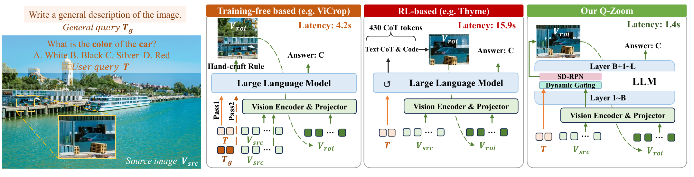
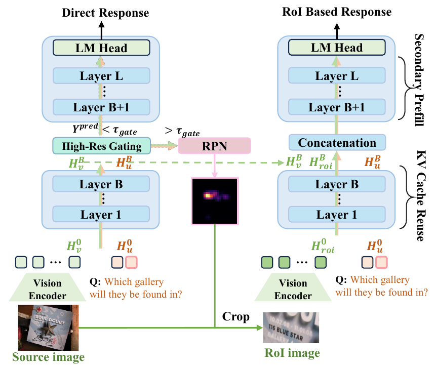
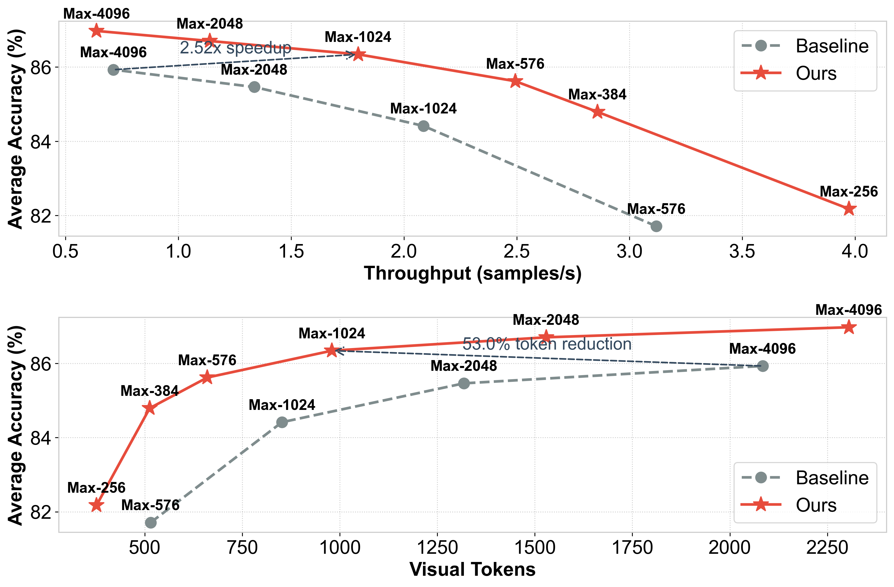
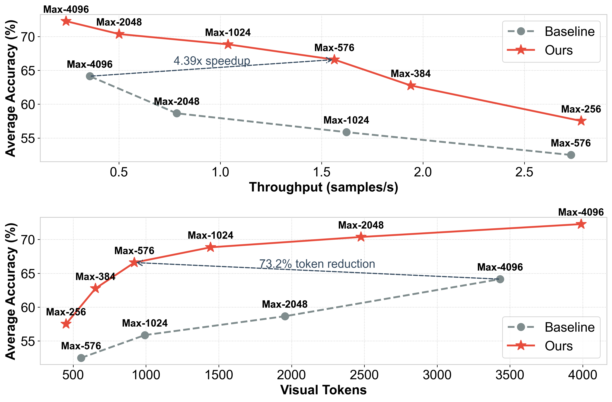
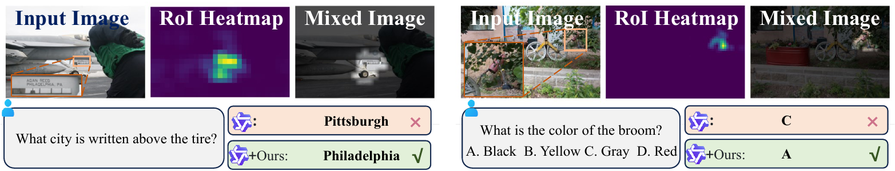
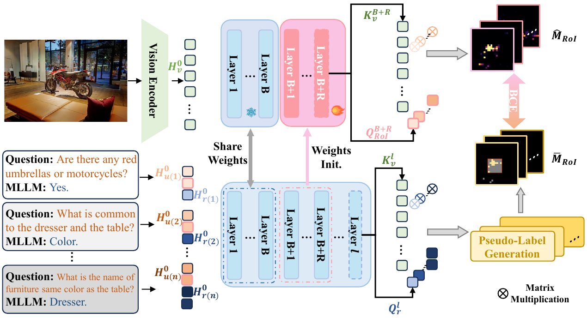
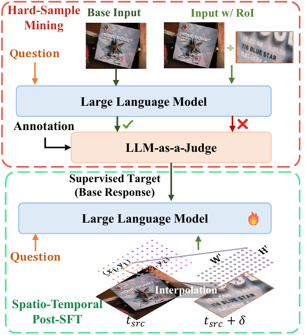
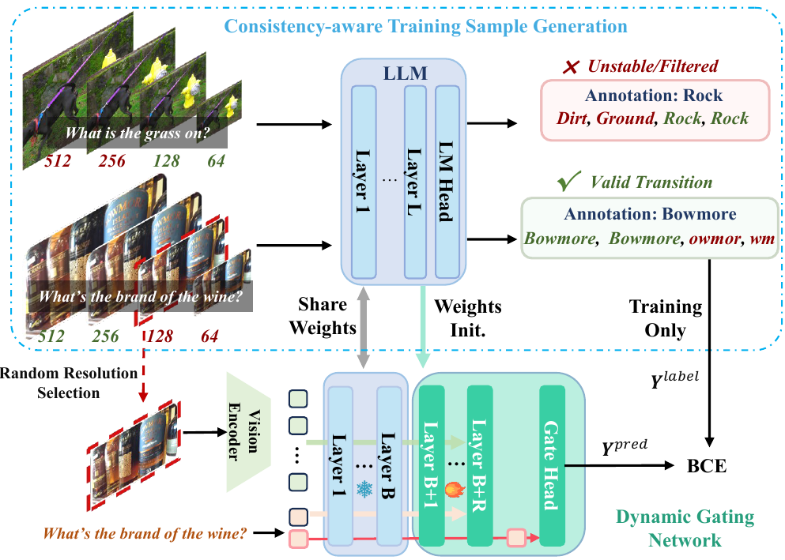

# Q-Zoom: Query-Aware Adaptive Perception for Efficient Multimodal Large Language Models

<p align="center">
  <a href="https://yuhengsss.github.io/Q-Zoom/"></a>
  &nbsp;
  <a href="https://huggingface.co/YuhengSSS/Q-Zoom-Qwen2.5VL-7B"></a>
  &nbsp;
  <a href="https://huggingface.co/datasets/YuhengSSS/Q-Zoom-Training"></a>
</p>

> 🌐 **Visit the project page at <https://yuhengsss.github.io/Q-Zoom/>** for an interactive
> walkthrough — main results tables, accuracy/throughput Pareto curves for both backbones,
> qualitative examples, and a 中文 toggle.

Q-Zoom is a **query-aware adaptive high-resolution perception framework**
for Multimodal Large Language Models that operates in an efficient
coarse-to-fine manner. Instead of indiscriminately flooding the
quadratic self-attention with redundant high-resolution tokens, Q-Zoom
adds two lightweight modules on top of a pretrained MLLM:

1. A **Dynamic Gating Network** that safely bypasses high-resolution
   processing whenever the coarse global features already suffice.
2. A **Self-Distilled Region Proposal Network (SD-RPN)** that, when
   high-resolution perception *is* needed, precisely localizes the
   task-relevant Region-of-Interest (RoI) directly from the MLLM's own
   intermediate feature space — no extra annotation, no external
   detector.

The gating network is trained with a *consistency-aware* sample-generation
strategy that yields deterministic routing labels, while the SD-RPN is
optimized with a fully self-supervised distillation objective. A
continuous spatio-temporal alignment scheme plus targeted post-SFT then
fuses the dense local RoI re-decode with the coarse global layout into a
single forward path.

On Qwen2.5-VL-7B, Q-Zoom **accelerates inference by 2.52× on Doc/OCR
benchmarks and 4.39× on high-resolution scenarios** while matching the
baseline's peak accuracy; configured for maximum perceptual fidelity it
**surpasses the baseline's peak by +1.1% (Doc/OCR) and +8.1% (HR)**. The
same recipe transfers seamlessly to Qwen3-VL, LLaVA, and emerging
RL-based thinking-with-image models.

<p align="center">
  
</p>

> Compared to training-tree-based detail-zoom methods (e.g. ViCrop) and
> RL-supervised tool-use methods (e.g. Thyme), Q-Zoom answers the same
> question with **a single forward pass plus an optional ROI re-decode**,
> gated per sample by the TWIG branch — at a fraction of the latency.

This repository contains:

- The modified Qwen2.5-VL and Qwen3-VL model code with TWIG / ROI support
  (`qwen_src/`).
- The DeepSpeed training framework with TWIG hooks (`qwen-vl-finetune/`).
- A local fork of `lmms-eval` with `qwen2_5_vl` / `qwen3_vl` chat-template
  evaluators that understand the `two_stage_roi` flag (`lmms-eval/`).
- The standardized data pipelines for Stage 1, 2 and 3
  (`standardized_pipeline/`).
- Reference experiment templates (`examples/`).

## Installation

```bash
git clone <this repo> Q-Zoom
cd Q-Zoom

# Recommended: use the helper. It creates the env, installs the right
# transformers pin, deepspeed 0.16.0, and a pre-built flash-attn 2.7.3
# wheel from the upstream GitHub release.
bash install.sh qwen2_5vl   # creates env "qzoom-q25", transformers==4.51.3
# or
bash install.sh qwen3vl     # creates env "qzoom-q3",  transformers==4.57.1
```

The recommended environment is **Python 3.10, PyTorch 2.4 (cu121)**, with
**deepspeed 0.16.0** and **flash-attention 2.7.3**. flash-attention 2 is
required by both the eval scripts (`attn_implementation=flash_attention_2`)
and by `qwen-vl-finetune` for training; it is **not** optional.

> ### ⚠️ `transformers` version per model family
>
> Q-Zoom touches model-private internals of both Qwen2.5-VL and Qwen3-VL,
> and the two backbones expect **different** `transformers` versions:
>
> | Model family | Required `transformers` version |
> |---|---|
> | **Qwen2.5-VL** (3B / 7B) experiments | `transformers==4.51.3` |
> | **Qwen3-VL** (4B) experiments | `transformers==4.57.1` |
>
> The two versions are **not** mutually compatible — running Qwen2.5-VL
> code with `transformers==4.57.1` (or vice versa) will fail with an
> `ImportError` or a model-loading mismatch. `install.sh` handles the
> right pin per family; if you install manually, run:
>
> ```bash
> # Qwen2.5-VL environment
> conda create -n qzoom-q25 python=3.10 -y
> conda activate qzoom-q25
> pip install -r requirements_roi_training.txt
> pip install --force-reinstall --no-deps "transformers==4.51.3"
> pip install -e ./lmms-eval
> pip install -e ./qwen-vl-utils
>
> # Qwen3-VL environment
> conda create -n qzoom-q3 python=3.10 -y
> conda activate qzoom-q3
> pip install -r requirements_roi_training.txt   # already pins 4.57.1
> pip install -e ./lmms-eval
> pip install -e ./qwen-vl-utils
> ```
>
> Notes:
> - `requirements_roi_training.txt` pins `transformers==4.57.1` (the
>   Qwen3-VL default — `4.57.0` was yanked from PyPI). For Qwen2.5-VL
>   experiments, downgrade with the `--force-reinstall` line above
>   **after** installing the rest of the requirements.
> - `flash-attn==2.7.3` is in the requirements file but `pip install`
>   will try to build it from source, which requires `nvcc` ≥ 11.7 and a
>   matching `CUDA_HOME` (e.g. `/usr/local/cuda-12.1`). The faster path
>   is to grab the pre-built wheel from the upstream
>   [flash-attention release](https://github.com/Dao-AILab/flash-attention/releases/tag/v2.7.3):
>
>   ```bash
>   wget https://github.com/Dao-AILab/flash-attention/releases/download/v2.7.3/flash_attn-2.7.3+cu12torch2.4cxx11abiFALSE-cp310-cp310-linux_x86_64.whl
>   pip install flash_attn-2.7.3+cu12torch2.4cxx11abiFALSE-cp310-cp310-linux_x86_64.whl
>   ```
>
>   `install.sh` does this download/install for you.

## Datasets

All training and data-generation scripts read from a single `${DATA_ROOT}`
directory. The full layout, the per-stage requirements, and the
Hugging Face download instructions are documented in
**[DATASETS.md](DATASETS.md)** — read it first if you plan to train
Q-Zoom from scratch.

The image archives (`.tar` / `.tar.gz` / `.zip`) used by every training
stage are mirrored at:

> **<https://huggingface.co/datasets/YuhengSSS/RoITraining>**

The Q-Zoom-specific training files — question JSONLs, Stage-1 pseudo-label
pickles, the Stage-2 judged Post-SFT JSONLs, and the Stage-3 ROI pickles —
are hosted in a **separate** dataset:

> **<https://huggingface.co/datasets/YuhengSSS/Q-Zoom-Training>**

Point `ROI_DATA_PATH` / `POST_SFT_JSONL` directly at the prepared per-backbone
files to skip the slow `standardized_pipeline/{stage1,stage2,stage3}/`
generation steps. See `DATASETS.md` for the per-stage filenames and
`huggingface-cli download` recipes. Eval-only users do not need any of
these files.

## Quick start: evaluate a Q-Zoom checkpoint

### Released Q-Zoom checkpoints

We host the final Stage-3 Q-Zoom checkpoints for all three supported
backbones on Hugging Face:

| Backbone | Q-Zoom checkpoint (HF) | TWIG config |
|---|---|---|
| Qwen2.5-VL-3B | [`YuhengSSS/Q-Zoom-Qwen2.5VL-3B`](https://huggingface.co/YuhengSSS/Q-Zoom-Qwen2.5VL-3B) | K=24, T=3 |
| Qwen2.5-VL-7B | [`YuhengSSS/Q-Zoom-Qwen2.5VL-7B`](https://huggingface.co/YuhengSSS/Q-Zoom-Qwen2.5VL-7B) | K=18, T=3 |
| Qwen3-VL-4B   | [`YuhengSSS/Q-Zoom-Qwen3VL-4B`](https://huggingface.co/YuhengSSS/Q-Zoom-Qwen3VL-4B)   | K=24, T=3 |

Download a checkpoint and point `CHECKPOINT_PATH` at it (replace the
backbone name to match your env):

```bash
huggingface-cli download YuhengSSS/Q-Zoom-Qwen2.5VL-7B \
  --local-dir ./checkpoints/Q-Zoom-Qwen2.5VL-7B \
  --local-dir-use-symlinks False
```

<p align="center">
  
</p>

> At inference time, Q-Zoom always produces a **direct response** from the
> low-resolution pass; the high-res gating head decides per sample whether
> to also produce a **RoI-based response** by re-decoding the cropped
> region predicted by the SD-RPN attention map.

```bash
CHECKPOINT_PATH=./checkpoints/Q-Zoom-Qwen2.5VL-7B \
NUM_GPUS=4 \
bash examples/eval_only/eval_qwen2_5vl_stage3.sh
```

This runs the standard Q-Zoom benchmark suite (TextVQA, InfoVQA, ChartQA,
OCRBench, DocVQA, V*Bench, MME-RealWorld-Lite, HRBench) with the
gating-aware decoding loop. Set `TWO_STAGE_ROI=False` to disable Q-Zoom and
fall back to vanilla decoding.

### Accuracy / throughput trade-off

Sweeping the input pixel budget (`Max-256` … `Max-4096`) traces a
Pareto curve. Q-Zoom (orange) shifts the curve up and to the right of the
baseline VLM (gray) on **both** Doc/OCR-heavy and high-resolution vision
benchmarks: at matched accuracy it is multiple times faster, and at
matched throughput it lifts average accuracy by several points.

> **Note:** the curves below are measured on **Qwen2.5-VL-7B**.

<p align="center">
  
  
</p>

### Qualitative examples

<p align="center">
  
</p>

> The TWIG branch produces a per-token attention map (middle column) that
> isolates the region the question is actually about. The model then
> re-decodes only that region to recover the correct answer.

## Training Q-Zoom from scratch

Q-Zoom is trained in three (or four, for Qwen3-VL backbones) stages,
each of which trains a **different subset** of parameters while leaving
everything else frozen:

**Stage 1 — TWIG initialization (SD-RPN).** Train **only the `twig_T`
twig layers** (the gating branch grafted on top of base layer `twig_K`)
using pseudo ROI maps generated by the base VLM. The base LLM,
`lm_head`, and vision encoder all stay frozen.

<p align="center">
  
</p>

<table>
<tr>
<td width="36%" valign="top">

<p><strong>Stage 2 — LLM post-SFT (Targeted SFT).</strong> Carry over the
frozen TWIG branch from Stage 1 and train <strong>only the LLM decoder
layers + <code>lm_head</code></strong> on a hard-sample mixture mined by
an LLM-as-a-Judge that compares the direct response against the ROI
response on a fresh question pool, so the LLM adapts to operate under
Q-Zoom gating.</p>

<p align="center">
  
</p>

</td>
<td width="60%" valign="top">

<p><strong>Stage 3 — High-resolution gating refinement (Dynamic Gate).</strong>
Train <strong>only the high-res gating network</strong>
(<code>high_res_layers</code> + <code>high_res_head</code>), which decides
whether each input needs the high-resolution ROI refinement pass. The
base LLM, <code>lm_head</code>, and TWIG branch are all frozen. Stage 3
uses a <em>consistency-aware</em> training sample generation pipeline
that filters unstable / contradictory examples before BCE supervision.</p>

<p align="center">
  
</p>

</td>
</tr>
</table>

**Stage 2.5 — TWIG re-fit on Stage-2 LLM** *(Qwen3-VL backbones only)*.
The Stage-2 SFT pass shifts Qwen3-VL's hidden-state distribution enough
that the TWIG branch from Stage 1 becomes mis-aligned. Re-train **only
the `twig_T` twig layers** for a few iterations on a small fixed-resolution
pseudo-label set generated by the Stage-2 LLM. Qwen2.5-VL backbones do
not need this stage.

The full template lives in `examples/`. Each subfolder
(`stage1_train_eval/`, `stage2_train_eval/`, `stage2_5_train_eval/`,
`stage3_train_eval/`) is a self-contained shell pipeline driven by
environment variables — there are no hardcoded user paths.

```bash
HOME_PATH=/path/to/home \
MODEL_PATH=Qwen/Qwen2.5-VL-7B-Instruct \
NUM_GPUS=4 \
bash examples/stage1_train_eval/run_all.sh
```

See `examples/README.md` for the full set of environment variables.

## Default TWIG configurations

| Backbone | twig_K | twig_T |
|---|---|---|
| Qwen2.5-VL-3B | 24 | 3 |
| Qwen2.5-VL-7B | 18 | 3 |
| Qwen3-VL-4B   | 24 | 3 |

`twig_K` is the number of base layers that stay frozen before the TWIG
branch; `twig_T` is the number of twig layers that produce the gating
prediction.

## Repository layout

```
Q-Zoom/
├── README.md                 # this file
├── DATASETS.md               # how to organize ${DATA_ROOT} + HF dataset link
├── LICENSE
├── install.sh
├── requirements_roi_training.txt
├── qwen_src/                 # modified Qwen2.5-VL / Qwen3-VL model code
├── qwen-vl-finetune/         # DeepSpeed training framework
├── qwen-vl-utils/            # vision processing helpers
├── lmms-eval/                # local lmms-eval fork with Q-Zoom evaluators
├── standardized_pipeline/    # Stage 1/2/3 data pipelines
├── merge_pruned_model.py     # merge TWIG layers back into a base checkpoint
├── merge_pruned_model_qwen3vl.py
└── examples/                 # end-to-end reference experiments
    ├── README.md
    ├── stage1_train_eval/
    ├── stage2_train_eval/
    ├── stage2_5_train_eval/  # (Qwen3-VL only) re-fit TWIG on Stage-2 LLM
    ├── stage3_train_eval/
    ├── multimax_tradeoff/    # accuracy vs throughput Pareto sweeps
    └── eval_only/
```

## Citation

If you use Q-Zoom in your research, please cite our paper:

```bibtex
@article{qzoom,
  title  = {Q-Zoom: Query-Aware Adaptive Perception for Efficient
            Multimodal Large Language Models},
  author = {Shi, Yuheng and Pei, Xiaohuan and Wen, Linfeng and
            Dong, Minjing and Xu, Chang},
  year   = {2026}
}
```

You may also be interested in our earlier work that introduced the
self-distilled RoI predictor used by Q-Zoom's SD-RPN branch:

```bibtex
@article{shi2025catching,
  title  = {Catching the Details: Self-Distilled RoI Predictors for
            Fine-Grained MLLM Perception},
  author = {Shi, Yuheng and Pei, Xiaohuan and Dong, Minjing and Xu, Chang},
  journal= {arXiv preprint arXiv:2509.16944},
  year   = {2025}
}
```

## License

This repository is released under the Apache 2.0 License (see `LICENSE`).
The code is built on top of the official [Qwen2.5-VL](https://github.com/QwenLM/Qwen2.5-VL)
and [lmms-eval](https://github.com/EvolvingLMMs-Lab/lmms-eval) repositories;
please respect their respective licenses as well.
